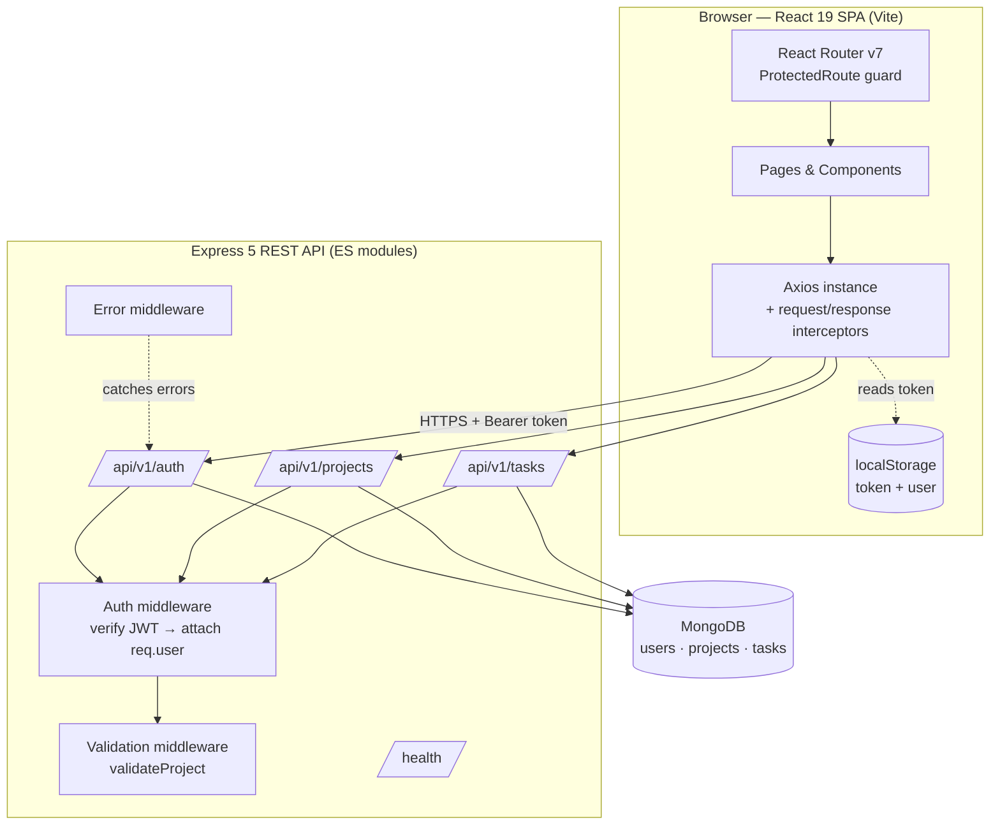
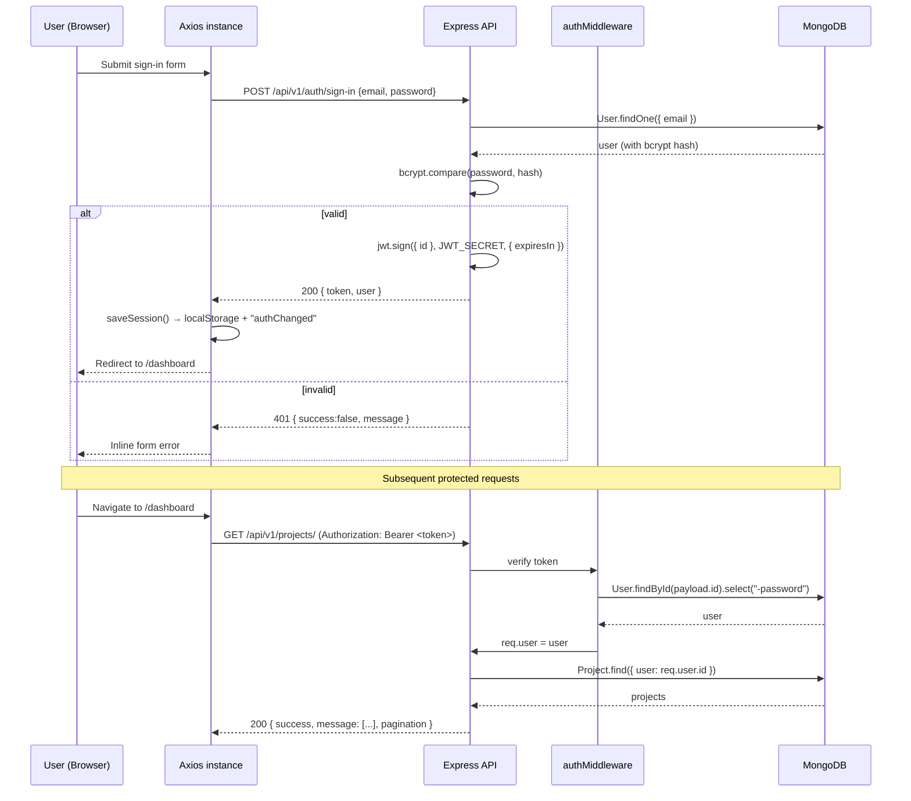
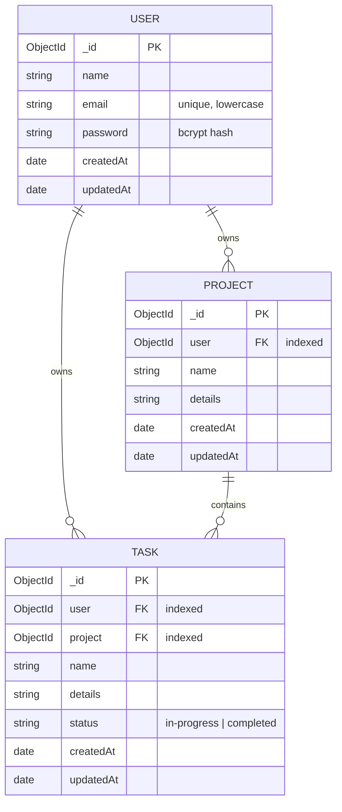

<div align="center">

# DevBoard

**A full-stack project & task management app — organize projects, break them into tasks, and watch progress build.**

[](https://devboard-5rvah5koq-iyiola-ajibola-s-projects.vercel.app/)
[](https://github.com/Iyio-dev/Devboard)


</div>

---

> **Note on this document:** Every feature, endpoint, environment variable, technology, and command below was read directly from the source in this repository. There are **no screenshots committed to the repo**, so no image is embedded here — see [Screenshots](#-screenshots). Nothing is documented that isn't backed by a file.

---

## 📖 Table of Contents

- [Overview](#-overview)
- [Problem / Solution](#-problem--solution)
- [Live Demo](#-live-demo)
- [Tech Stack](#-tech-stack)
- [Architecture](#-architecture)
- [Core Features](#-core-features)
- [Feature Showcase](#-feature-showcase)
- [Authentication Flow](#-authentication-flow)
- [API Reference](#-api-reference)
- [Database & Data Model](#-database--data-model)
- [Engineering Decisions](#-engineering-decisions)
- [Project Structure](#-project-structure)
- [Local Development](#-local-development)
- [Environment Variables](#-environment-variables)
- [Deployment](#-deployment)
- [Responsiveness & Accessibility](#-responsiveness--accessibility)
- [Testing](#-testing)
- [Security Notes](#-security-notes)
- [Known Limitations](#-known-limitations)
- [Challenges & Solutions](#-challenges--solutions)
- [Lessons Learned](#-lessons-learned)
- [Roadmap](#-roadmap)
- [Screenshots](#-screenshots)
- [Links](#-links)
- [Author](#-author)
- [License](#-license)

---

## 🎯 Overview

**DevBoard** is a project and task management web app where an authenticated user creates projects, adds tasks to those projects, toggles tasks between *in-progress* and *completed*, and sees completion statistics update across a dashboard.

It is built as a **decoupled full-stack application**:

- A **React 19 + Vite** single-page app handles routing, UI state, and rendering.
- An **Express 5 REST API** (ES modules) owns authentication, validation, and data access.
- **MongoDB** via **Mongoose** persists users, projects, and tasks.

**Who it's for:** individual developers and small teams who want a lightweight, self-hostable way to track project progress without a heavyweight tool.

**Core workflow:**

```
Sign up → Create a project → Add tasks → Toggle tasks complete → Watch progress & dashboard stats update
```

**What makes the implementation interesting:** it is not a CRUD tutorial. It includes JWT authentication with a response-side interceptor that force-logs-out on a rejected token, per-user ownership enforced at the *query* level rather than only at the route level, server-side pagination utilities, compound MongoDB indexes matched to the actual query shapes, optimistic UI updates with rollback on failure, and a small custom toast system built without a notification library.

---

## 🧩 Problem / Solution

### Problem
Tracking project progress in notes or spreadsheets means you lose the connection between *what you're working on* (projects), *the individual steps* (tasks), and *how much is actually done* (progress). Most lightweight tools are either too heavy or hide your data behind an account you don't control.

### Solution
DevBoard ties the three together in a single workflow:

1. Every **task belongs to a project**, and both belong to a user.
2. Toggling a task's status immediately recalculates that project's **completion percentage** and the dashboard's aggregate stats (total / in-progress / completed / completion rate).
3. Ownership is enforced in the backend query (every read and write filters by `user`), so users can only ever see and mutate their own data.
4. The stack is a plain Express + MongoDB API, so the whole thing can be self-hosted.

---

## 🚀 Live Demo

> **Live app:** **<https://devboard-two-flax.vercel.app/>**

There is **no demo video or GIF** committed to this repository, and **no demo credentials** are published (`backend/src/.env.example` contains placeholders only). Create a free account on the live URL to try it — sign-up returns a JWT and logs you straight into the dashboard.

---

## 🛠 Tech Stack

Everything below appears in `backend/package.json` or `frontend/package.json`.

### Frontend
| Package | Version | Role |
|---|---|---|
| `react` / `react-dom` | `^19.2.8` | UI library |
| `vite` | `^8.3.0` | Dev server & build tool |
| `react-router-dom` | `^7.18.3` | Client-side routing |
| `tailwindcss` + `@tailwindcss/vite` | `^4.3.3` | Utility-first styling (v4 Vite plugin) |
| `axios` | `^1.20.0` | HTTP client with interceptors |
| `lucide-react` | `^1.45.0` | Icon set |
| `eslint` (+ `@eslint/js`, `eslint-plugin-react-hooks`, `eslint-plugin-react-refresh`) | `^10.x` / `^7.1.1` / `^0.5.6` | Linting |

### Backend
| Package | Version | Role |
|---|---|---|
| `express` | `^5.2.1` | HTTP server & routing |
| `mongoose` | `^9.9.5` | MongoDB ODM |
| `jsonwebtoken` | `^9.0.3` | JWT issuing & verification |
| `bcryptjs` | `^3.0.3` | Password hashing |
| `cors` | `^2.8.6` | Cross-origin requests |
| `dotenv` | `^17.4.2` | Environment configuration |
| `nodemon` *(dev)* | `^3.1.14` | Dev auto-reload |

### Database
MongoDB (connection string supplied via `MONGO_URI`; e.g. MongoDB Atlas in production).

### Authentication
JWT bearer tokens (`jsonwebtoken`) + password hashing with `bcryptjs`.

### Deployment
Documented in the project README as **Vercel** (frontend) + **Render** (backend) + **MongoDB Atlas** (database). No `vercel.json`, `render.yaml`, or `Procfile` is committed, so deploy configuration is platform-default.

---

## 🏗 Architecture



**How the layers talk to each other:**

- The SPA never talks to MongoDB directly — all data access goes through the API.
- A single Axios instance (`frontend/src/services/api.js`) sets `VITE_API_URL` as its base URL, injects the `Authorization: Bearer <token>` header from `localStorage` on every request, and handles rejected tokens globally.
- On the server, `server.js` mounts three routers under `/api/v1/*`, exposes `GET /health`, registers a JSON 404 handler and a central error middleware, then connects to MongoDB before calling `app.listen`.
- Each protected router runs `authMiddleware` first; the middleware verifies the token, loads the user (excluding the password), and attaches it as `req.user`.

---

## ✨ Core Features

All features below are verifiable in the source files listed beside them.

### 🔐 Authentication
- Email + password **sign-up** and **sign-in** (`backend/src/controllers/authController.js`).
- Passwords hashed with **bcryptjs** (cost factor 10); plaintext passwords are never stored.
- Minimum **8-character** password enforced on both client (`SignUp.jsx`) and server (`authController.js`).
- **JWT** issued on sign-up/sign-in with configurable expiry (`TOKEN_EXPIRES_IN`, example value `7d`).
- **`GET /auth/me`** returns the current user, used by the Profile page to survive a refresh.
- Duplicate-email rejected with **409**; wrong credentials with **401**; unknown email with **404**.

### 📁 Project Management
- Create a project with a name + description (`CreateProject.jsx` → `POST /projects/create`).
- List all of the user's projects, newest first, with pagination metadata (`getAllProjects`).
- Open a single project (`ProjectDetails.jsx` → `GET /projects/:id`).
- Edit a project through a modal dialog (`UpdateProject.jsx` → `PUT /projects/update/:id`).
- Delete a project behind a confirmation dialog (`ConfirmDialog.jsx` → `DELETE /projects/delete/:id`).
- Deleting a project **also deletes all of its tasks** (`deleteProject` controller runs `Task.deleteMany`).

### ✅ Task Management
- Add tasks to a project (`ProjectDetails.jsx` → `POST /tasks/:id/create`).
- Edit a task inline via a modal (`PUT /tasks/update/:id`).
- Toggle a task between `in-progress` and `completed` (`PATCH /tasks/complete/:id`).
- Delete a task (`DELETE /tasks/delete/:id`).
- Filter tasks by **All / In Progress / Completed** and search by name or details (client-side, `ProjectDetails.jsx`).

### 📊 Dashboard
- Five aggregate stat cards: **Total Projects, Total Tasks, In-Progress Tasks, Completed Tasks, Completion Rate** (`Dashboard.jsx` + `DashboardStats.jsx`).
- Per-project **completion percentage** computed from that project's task statuses.
- Project search that matches name or description.
- Skeleton loading placeholders (`animate-pulse`) and an error state with a **Try Again** button.

### 🎨 User Experience
- Custom **toast** notification system (success/error, auto-dismiss after 4s, `aria-live="polite"`) — no external toast library (`components/Toast.jsx`, `toastContext.js`).
- **Optimistic status updates** with automatic rollback if the request fails (`toggleTaskStatus` in `ProjectDetails.jsx`).
- Route-level **loading and error states** with retry.
- Marketing **landing page** with hero, feature cards, "how it works" steps and CTA (`pages/Home.jsx`).
- **404 page** with catch-all redirect (`NotFound.jsx`, `App.jsx`).
- **Profile** page showing name, email and member-since date (`pages/Profile.jsx`).

---

## 🖼 Feature Showcase

| Feature | Description | Where |
|---|---|---|
| Authentication | Email/password sign-up & sign-in; bcrypt hashing; JWT bearer tokens | `authController.js`, `Login.jsx`, `SignUp.jsx` |
| Protected routing | Client guard redirects unauthenticated users to sign-in, preserving the intended route | `ProtectedRoute.jsx` |
| Session handling | Token + user cached in `localStorage`; `authChanged` event keeps the navbar in sync | `services/auth.js`, `Navbar.jsx` |
| Project management | Full create / read / update / delete with ownership scoping | `projectController.js`, `ProjectSection.jsx`, `UpdateProject.jsx` |
| Task management | Per-project tasks with create / edit / delete / status toggle | `taskController.js`, `ProjectDetails.jsx` |
| Progress tracking | Per-project % and dashboard-wide completion rate | `Dashboard.jsx`, `ProjectDetails.jsx` |
| Search & filter | Project search; task search + All/In Progress/Completed filters | `ProjectSection.jsx`, `ProjectDetails.jsx` |
| Pagination | `page`/`limit` query params with metadata (default 20, max 100) | `utils/paginate.js` |
| Reusable UI | `ConfirmDialog`, `Toast`, `DashboardStats`, `ProjectCard` | `frontend/src/components/` |
| Responsive shell | Tailwind breakpoints + collapsible mobile menu | `Navbar.jsx` |

---

## 🔑 Authentication Flow



**Key behaviors verified in the code:**

- **Token storage:** `localStorage` under the key `token`; the user object under `user` (`services/auth.js`).
- **Token sending:** a request interceptor adds `Authorization: Bearer <token>` to every call (`services/api.js`).
- **Middleware verification:** `authMiddleware.js` rejects missing/malformed headers with **401**, verifies with `jwt.verify`, then loads the user with **`-password` excluded** so a hash can never leak into `req.user`.
- **Global 401 handling:** a response interceptor clears the session and redirects to `/sign-in` on any 401 **except** login failures (it explicitly ignores messages containing "password" or "account" so the form can show its own error).
- **Ownership:** every project and task query includes `user: req.user.id`, so guessing another user's ID returns a 404 rather than their data.

---

## 📡 API Reference

**Base URL:** `/api/v1` (local: `http://localhost:5001/api/v1`)

All responses follow a consistent envelope:

```json
{ "success": true, "message": "...", "result": { } }
```

Note that list endpoints return the array under the `message` key (e.g. `{ success: true, message: [ ... ], pagination: { ... } }`) — a naming quirk carried through the current implementation.

### Health
| Method | Endpoint | Auth | Description |
|---|---|---|---|
| GET | `/health` | No | Liveness check → `{ success: true, message: "DevBoard API is running" }` |

### Authentication — mounted at `/api/v1/auth/`
| Method | Endpoint | Auth | Description |
|---|---|---|---|
| POST | `/api/v1/auth/sign-up` | No | Register a user; returns `token` + `user` |
| POST | `/api/v1/auth/sign-in` | No | Authenticate; returns `token` + `user` |
| GET | `/api/v1/auth/me` | **Yes** | Return the current user (id, name, email, createdAt) |

**Sign-up body**
```json
{ "name": "Ada Lovelace", "email": "ada@example.com", "password": "at-least-8-chars" }
```

### Projects — mounted at `/api/v1/projects/`
| Method | Endpoint | Auth | Validation | Description |
|---|---|---|---|---|
| POST | `/api/v1/projects/create` | Yes | `validateProject` | Create a project |
| GET | `/api/v1/projects/` | Yes | — | List the user's projects (paginated) |
| GET | `/api/v1/projects/:id` | Yes | — | Get one owned project |
| PUT | `/api/v1/projects/update/:id` | Yes | `validateProject` | Update an owned project |
| DELETE | `/api/v1/projects/delete/:id` | Yes | — | Delete an owned project **and its tasks** |
| GET | `/api/v1/projects/:id/tasks` | Yes | — | List tasks within one project (paginated) |

**Project body**
```json
{ "name": "Portfolio site", "details": "Rebuild personal site with a blog" }
```
`validateProject` requires both fields to be non-empty strings and `name` to be at least 3 characters.

### Tasks — mounted at `/api/v1/tasks/`
| Method | Endpoint | Auth | Description |
|---|---|---|---|
| POST | `/api/v1/tasks/:id/create` | Yes | Create a task inside project `:id` (verifies the project is owned) |
| GET | `/api/v1/tasks/all` | Yes | List all of the user's tasks (paginated) |
| GET | `/api/v1/tasks/:id` | Yes | Get one owned task |
| PUT | `/api/v1/tasks/update/:id` | Yes | Update a task's name/details |
| PATCH | `/api/v1/tasks/complete/:id` | Yes | Toggle status between `completed` and `in-progress` |
| DELETE | `/api/v1/tasks/delete/:id` | Yes | Delete an owned task |

**Task body**
```json
{ "name": "Design hero section", "details": "Dark theme, single CTA" }
```

### Pagination
List endpoints accept `?page=` and `?limit=` and return:

```json
{
  "pagination": {
    "page": 1, "limit": 20, "total": 42,
    "totalPages": 3, "hasNextPage": true, "hasPrevPage": false
  }
}
```
Defaults: `limit = 20`, hard cap `100`, invalid values fall back to page 1 / limit 20 (`backend/src/utils/paginate.js`).

### Error responses
`errorMiddleware.js` normalizes failures; Mongoose errors are mapped too:

| Situation | Status | Message |
|---|---|---|
| Missing/invalid/expired token | 401 | `Not authorized, token missing` / `Token invalid or expired` / `User not found` |
| Missing fields | 400 | `Missing fields required` |
| Mongoose `ValidationError` | 400 | `Invalid data` |
| Duplicate key (`11000`) | 409 | `A user with this information already exists` |
| Not found | 404 | e.g. `Project not found`, `Task not found` |
| Unknown route | 404 | `Route not found` |
| Anything else | 500 | `Internal Server Error` |

---

## 🗄 Database & Data Model



**Notes from the schemas:**

- All three models use `timestamps: true`, so `createdAt` / `updatedAt` are automatic.
- `User.email` is `unique`, `lowercase`, and trimmed — so a duplicate registration races resolve at the DB level (surfaced as a 409 by the error middleware).
- `Task.status` is constrained by an `enum` to exactly `"in-progress"` or `"completed"`, defaulting to `"in-progress"`.
- **Compound indexes are deliberately matched to query shape.** `Project.js` includes a comment explaining `{ user: 1, createdAt: -1 }` serves the list-and-sort pattern; `Task.js` adds both `{ user: 1, createdAt: -1 }` and `{ user: 1, project: 1, createdAt: -1 }` to cover "all my tasks" and "my tasks for this project" without a collection scan.
- Models are exported with `mongoose.models.X || mongoose.model("X", schema)` — a guard that prevents `OverwriteModelError` during dev hot-reload.

---

## 🧠 Engineering Decisions

These are implementation choices visible in the code, with the reasoning each one encodes.

### 1. Ownership enforced in the query, not just the route
**What:** Controllers never fetch by `_id` alone; every project/task query is `{ _id, user: req.user.id }` (see `getOwnedProjectQuery` and the task equivalents).
**Why:** Route-level protection only proves *someone* is logged in — not that they own the resource.
**Benefit:** A user who guesses another user's ObjectId gets a clean `404 Project not found` instead of someone else's data. A comment in `taskController.js` states this intent explicitly.

### 2. `isValidObjectId` guard before every lookup
**What:** A small utility checks `mongoose.Types.ObjectId.isValid(id)` and returns a 404 for malformed IDs.
**Why:** Casting a bad string makes Mongoose throw a `CastError`, which surfaces as an unhelpful 500.
**Benefit:** Bad IDs are indistinguishable from missing resources to the client — no internals leaked, consistent API behavior.

### 3. `asyncHandler` wrapper for all controllers
**What:** `asyncHandler(fn)` wraps async controllers so a rejected promise is forwarded to `next`.
**Why:** Express does not catch rejected promises from async handlers on its own.
**Benefit:** No try/catch boilerplate in every controller; failures always reach the central error middleware.

### 4. Centralized error middleware
**What:** A single `errorMiddleware` translates thrown/`next()`-ed errors into `{ success: false, message }` and remaps Mongoose-specific errors.
**Why:** Consistent error shape for the frontend to rely on.
**Benefit:** The client can read `error.response.data.message` in one place and display it; 409/400 mapping happens server-side.

### 5. Single Axios instance with interceptors
**What:** `services/api.js` creates one client with the base URL, injects the bearer token on request, and handles 401s on response.
**Why:** Auth logic in one place instead of repeated in every fetch.
**Benefit:** Adding an endpoint needs no auth wiring, and an expired token logs the user out everywhere at once instead of leaving a broken half-session.

### 6. Client-side route guard that remembers intent
**What:** `ProtectedRoute` redirects to `/sign-in` **with the attempted path in navigation state**, and `Login` redirects back to it after success.
**Why:** Sending a logged-out user to the dashboard after login loses where they were going.
**Benefit:** Deep links survive the login detour.

### 7. Optimistic UI with rollback
**What:** `toggleTaskStatus` updates the task in state immediately, then reverts to the saved `previousTasks` snapshot if the request fails.
**Why:** A round-trip delay on every checkbox toggle feels sluggish.
**Benefit:** Instant feedback without lying to the user — a failed request restores the true state and shows an error toast.

### 8. Pagination as a reusable utility
**What:** `getPagination` / `buildPaginationMeta` are shared by all list endpoints.
**Why:** Every list endpoint otherwise re-parses `page`/`limit` differently.
**Benefit:** One clamp rule (default 20, max 100) and one metadata shape across the API; oversized `limit` values can't be used to dump the collection.

### 9. Compound indexes matched to queries
**What:** Indexes declared in the schemas mirror the exact `filter + sort` used in the controllers.
**Why:** A compound index only helps if its prefix matches how the query is shaped.
**Benefit:** List queries avoid in-memory sorts and collection scans as data grows.

### 10. No external toast library
**What:** `ToastProvider` + `useToast` context implement notifications in ~74 lines.
**Why:** The app needed two variants (success/error) and nothing else.
**Benefit:** One less dependency; the context is split into its own module (`toastContext.js`) specifically to keep React Fast Refresh happy.

### 11. State grouped by concern
**What:** Complex pages group related state into objects — e.g. `projectState`, `taskState`, `taskForm`, `uiState` in `ProjectDetails.jsx`; `dataState`, `status`, `uiState` in `Dashboard.jsx`.
**Why:** ~10 independent `useState` calls make the component hard to scan.
**Benefit:** Updates read as `setStatus(prev => ({ ...prev, loading: false }))`, and it's obvious which slice a change belongs to.

### 12. Destructive actions gated by a confirmation dialog
**What:** `ConfirmDialog` is a reusable, controlled component with its own loading label ("Deleting...").
**Why:** Project deletion cascades to tasks and cannot be undone.
**Benefit:** One dialog component serves every destructive action; the copy warns about the cascade.

---

## 📂 Project Structure

```text
Devboard/
├── .gitignore
├── README.md
│
├── backend/
│   ├── .gitignore
│   ├── package.json
│   ├── package-lock.json
│   └── src/
│       ├── .env                 # local secrets (gitignored)
│       ├── .env.example         # documented variables
│       ├── server.js            # app bootstrap, route mounting, /health
│       ├── config/
│       │   └── db.js            # MongoDB connection + MONGO_URI check
│       ├── controllers/
│       │   ├── authController.js     # signUp, signIn, getMe
│       │   ├── projectController.js  # project CRUD + ownership scoping
│       │   └── taskController.js     # task CRUD + status toggle + project tasks
│       ├── middlewares/
│       │   ├── authMiddleware.js     # JWT verify → req.user
│       │   ├── errorMiddleware.js    # central error normalizer
│       │   ├── validateProject.js    # project body validation
│       │   └── validateTask.js       # task body validation
│       ├── models/
│       │   ├── User.js               # name, email (unique), password
│       │   ├── Project.js            # user ref, name, details + compound index
│       │   └── Task.js               # user + project refs, status enum, indexes
│       ├── routes/
│       │   ├── authRoutes.js         # /api/v1/auth
│       │   ├── projectRoutes.js      # /api/v1/projects
│       │   └── taskRoutes.js         # /api/v1/tasks
│       └── utils/
│           ├── asyncHandler.js       # promise → next(err) wrapper
│           ├── isValidObjectId.js    # ObjectId guard
│           └── paginate.js           # page/limit parsing + metadata
│
└── frontend/
    ├── .env.example
    ├── .gitignore
    ├── index.html
    ├── package.json
    ├── package-lock.json
    ├── vite.config.js                # React + Tailwind v4 plugins
    ├── eslint.config.js
    └── src/
        ├── main.jsx                  # root render: BrowserRouter + ToastProvider
        ├── App.jsx                   # route table
        ├── App.css
        ├── index.css                 # Tailwind entry
        ├── toastContext.js           # useToast hook / context
        ├── components/
        │   ├── Navbar.jsx            # responsive nav + auth area
        │   ├── ProtectedRoute.jsx    # client-side auth guard
        │   ├── Login.jsx
        │   ├── SignUp.jsx
        │   ├── DashboardHeader.jsx
        │   ├── DashboardStats.jsx
        │   ├── ProjectSection.jsx    # project grid + search
        │   ├── ProjectCard.jsx
        │   ├── ProjectDetails.jsx    # project page + task CRUD (largest file)
        │   ├── UpdateProject.jsx     # edit-project modal
        │   ├── ConfirmDialog.jsx     # reusable destructive-action dialog
        │   └── Toast.jsx             # toast provider + container
        ├── pages/
        │   ├── Home.jsx              # landing page
        │   ├── Dashboard.jsx         # stats + projects
        │   ├── CreateProject.jsx
        │   ├── Profile.jsx
        │   └── NotFound.jsx
        └── services/
            ├── api.js                # Axios instance + interceptors
            └── auth.js               # session/token helpers
```

**Size reference:** backend ≈ **857 lines** of JavaScript across 18 files; frontend ≈ **2,979 lines** across 21 JS/JSX files.

---

## 💻 Local Development

### Prerequisites
- **Node.js** with ES module support (the backend sets `"type": "module"`; Express 5 and Mongoose 9 are used).
- **npm** (both `package-lock.json` files are present).
- A **MongoDB** instance — local (`mongodb://localhost:27017/...`) or a MongoDB Atlas cluster.

### 1. Clone

```bash
git clone https://github.com/Iyio-dev/Devboard.git
cd Devboard
```

### 2. Install dependencies

```bash
cd backend && npm install
cd ../frontend && npm install
```

### 3. Configure environment variables

Create `backend/.env` (copy `backend/src/.env.example`):

```env
MONGO_URI=mongodb://localhost:27017/devboard
PORT=5001
JWT_SECRET=replace-with-a-long-random-string
TOKEN_EXPIRES_IN=7d
CLIENT_URL=
```

Create `frontend/.env` (copy `frontend/.env.example`):

```env
VITE_API_URL=http://localhost:5001/api/v1
```

> `VITE_API_URL` **must include the `/api/v1` prefix** — it becomes the Axios base URL.

### 4. Run both servers

Backend (with auto-reload):

```bash
cd backend
npm run dev      # nodemon src/server.js
```

Production-style start:

```bash
cd backend
npm start        # node src/server.js
```

Frontend, in a second terminal:

```bash
cd frontend
npm run dev      # vite
```

The API verifies `MONGO_URI` on boot and exits if the connection fails; `GET http://localhost:5001/health` confirms it's up.

### 5. Production build (frontend)

```bash
cd frontend
npm run build    # vite build → dist/
npm run preview  # serve the built output locally
```

### 6. Lint (frontend)

```bash
cd frontend
npm run lint     # eslint .
```

---

## 🔧 Environment Variables

### Backend (`backend/.env`)

| Variable | Description | Required | Example |
|---|---|---|---|
| `MONGO_URI` | MongoDB connection string. The server throws on boot if it's missing. | **Yes** | `mongodb://localhost:27017/devboard` |
| `JWT_SECRET` | Secret used to sign and verify JWTs. Auth routes throw if it isn't set. | **Yes** | `replace-with-a-long-random-string` |
| `PORT` | Port the Express server listens on. | No (default `5001`) | `5001` |
| `TOKEN_EXPIRES_IN` | JWT lifetime passed to `jwt.sign`. | No | `7d` |
| `CLIENT_URL` | Comma-separated list of allowed origins (parsed in `server.js` for production CORS). | No | `https://devboard-two-flax.vercel.app` |

> ⚠️ **CORS note:** `server.js` parses `CLIENT_URL` into an `allowedOrigins` array, but the app currently calls `app.use(cors())` with no options — meaning the array is not yet applied and the API allows all origins. See [Known Limitations](#-known-limitations).

### Frontend (`frontend/.env`)

| Variable | Description | Required | Example |
|---|---|---|---|
| `VITE_API_URL` | Base URL of the backend API, **including `/api/v1`**. | **Yes** | `http://localhost:5001/api/v1` |

`.env` files are gitignored at the repo root (`.env`, `.env.*`, with `!.env.example` re-included), so only the example files ship.

---

## ☁️ Deployment

The project README documents the following production setup:

| Layer | Platform | Notes |
|---|---|---|
| Frontend (React/Vite) | **Vercel** | Live at <https://devboard-two-flax.vercel.app/>; Vite outputs a static `dist/` |
| Backend (Express API) | **Render** | Runs `npm start` (`node src/server.js`); `PORT` is provided by the host |
| Database | **MongoDB Atlas** | Connection string supplied through `MONGO_URI` |

**Production configuration to be aware of:**

- No `vercel.json`, `render.yaml`, `Procfile`, or `Dockerfile` is committed — deployment relies on platform defaults plus environment variables set in each dashboard.
- The frontend's `VITE_API_URL` must point at the deployed API so the built bundle calls the live backend.
- `CLIENT_URL` should list the deployed frontend origin once the CORS block is wired up (see limitations).

---

## ♿ Responsiveness & Accessibility

Verified from the markup — no formal audit has been run, so nothing here is a WCAG claim:

- **Responsive layouts** using Tailwind breakpoints (`sm:`, `md:`, `lg:`) throughout dashboards, grids and forms; the dashboard stat grid is `1 → 2 → 5` columns.
- **Mobile navigation** with a toggle button carrying `aria-label="Toggle menu"` and `aria-expanded`, which auto-closes on route change.
- **Form labels** are programmatically associated via `htmlFor` / `id` (e.g. `email`, `password`, `name`, `projectName`, `editProjectName`).
- **Dialogs** use `role="dialog"`, `aria-modal="true"` and `aria-labelledby` (`UpdateProject`, `ConfirmDialog`).
- **Icon-only buttons** have `aria-label` (e.g. `Delete project <name>`, `Close dialog`, `Dismiss notification`).
- **Toasts** are announced through a container with `aria-live="polite"` and `role="status"` on each item.
- **Keyboard-friendly controls:** all interactive elements are native `<button>`, `<a>`/`<Link>`, `<input>` and `<textarea>`, so focus and activation work without custom key handling.

**Not implemented:** no skip links, no focus trap/return-focus logic in the modals, and no automated accessibility tests.

---

## 🧪 Testing

**There are no tests in this repository.** A `find` for `*.test.*` / `*.spec.*` returns nothing, and neither `package.json` defines a `test` script or a test dependency.

Testing (API integration tests for the auth/ownership paths, and component tests for the task flow) is planned for a future iteration. See [Roadmap](#-roadmap).

---

## 🔒 Security Notes

Practices that are actually implemented:

- **Password hashing** with `bcryptjs` at cost factor 10; hashes are never selected into `req.user` (`select("-password")`).
- **JWT bearer authentication** on every protected route, with expiry (`TOKEN_EXPIRES_IN`).
- **Ownership checks** embedded in every project/task query, so cross-user access returns 404.
- **Server-side validation:** required fields, string type checks, and minimum name length in `validateProject`; explicit field checks in the auth and task controllers; a Mongoose `enum` on task status.
- **Secrets via environment variables**, with `.env` gitignored and only `.env.example` committed.
- **Generic error messages** — bad IDs and unauthorized resources both return 404 to avoid leaking existence.

Deliberately **not** claimed: rate limiting, refresh tokens, CSRF protection, HTTPS enforcement (handled by the host), and any production security audit. Tokens are stored in `localStorage`, which is readable by any script on the page — a common SPA trade-off that would need revisiting for high-value sessions.

---

## ⚠️ Known Limitations

Documented honestly so the next contributor knows what's real:

- **CORS allow-list is unwired.** `server.js` computes `allowedOrigins` from `CLIENT_URL` but then calls `cors()` without passing it, so the list has no effect.
- **`validateTask.js` is not mounted.** The middleware exists, but `taskRoutes.js` doesn't import or apply it — task validation currently lives inline in `taskController.js`.
- **List payloads use the `message` key.** List endpoints put the array in `message` rather than `result`, which is inconsistent with single-resource responses.
- **Pagination is server-ready but client-untouched.** The API returns pagination metadata, but the dashboard loads the first page only.
- **A frontend render bug exists in the project grid.** `ProjectSection.jsx` computes `projectProgress` and passes it down, but `ProjectCard.jsx` never destructures that prop and instead renders a bare `projectProgress` identifier — which is not in scope. This needs a one-line fix (destructure the prop) before the card percentage renders correctly.
- **No auto-refresh of expired sessions.** The interceptor logs the user out rather than silently renewing the token.
- **No tests, no CI.** Nothing runs on push.
- **`CLIENT_URL` / deployment specifics depend on dashboard configuration** not captured in the repo.

---

## 🧗 Challenges & Solutions

Inferred from the surviving commit history and the code's own comments.

### Challenge 1 — Getting authentication coherent across the stack
The commit history contains an explicit stabilization commit: *"fix: repair signup flow, auth middleware, and field mismatches; clean repo for release."* Later files carry comments like *"Used by the frontend to keep user info after a page refresh"* — evidence that keeping client and server in sync was a genuine problem.

**Solution**
- Standardized the response envelope (`token` + `user`) so `saveSession` has one shape to trust.
- Added `GET /auth/me` specifically so a refreshed page could recover the user from the token instead of relying only on stale `localStorage`.
- Introduced the `authChanged` window event so the navbar re-reads auth state whenever the session changes.
- The response interceptor deliberately excludes login-failure messages from its force-logout rule, so a wrong password doesn't nuke a valid session elsewhere.

**Result:** Sign-up, sign-in, refresh, and logout now follow one path, and a rejected token logs out cleanly instead of leaving the UI in an inconsistent state.

### Challenge 2 — Making "my data" actually mean my data
Route-level middleware proves someone is authenticated, but nothing about *which* records they may touch.

**Solution:** Every lookup became an ownership-scoped query (`{ _id, user: req.user.id }`), project deletion cascades with `Task.deleteMany`, and a dedicated `isValidObjectId` guard turns malformed IDs into clean 404s rather than Mongoose cast errors.

**Result:** ID guessing returns 404 instead of leaking another user's data, and the API behaves predictably for garbage input.

### Challenge 3 — Keeping a snappy UI honest
Toggling a checkbox shouldn't need a spinner, but optimistic updates can drift from the server.

**Solution:** Snapshot the prior task list, update state instantly, then overwrite with the server's `result.status` on success — or restore the snapshot and toast an error on failure.

**Result:** Instant feedback with a correct state even when the network fails.

### Challenge 4 — Imposing structure on growing page components
`ProjectDetails.jsx` handles a project, its tasks, two forms, filters and three dialogs — and it's the single largest file in the app.

**Solution:** State was grouped into `projectState`, `taskState`, `taskForm` and `uiState`; derived values (completed count, progress %, visible tasks) are computed at render instead of stored; and repeated UI (confirm dialog, toast) was extracted into reusable components.

**Result:** The component stays readable roughly 1,000 lines in, and duplicated UI exists in one place.

### Challenge 5 — Shipping a small notification system without another dependency
**Solution:** A ~74-line `ToastProvider`/`useToast` context pair with auto-dismiss and success/error variants. The context was split into its own file on purpose so the hook can be imported without pulling the provider — a Fast Refresh compatibility note left in the code.

**Result:** Consistent feedback across the app with zero added libraries.

---

## 📚 Lessons Learned

Concrete takeaways from building this codebase:

- **Backend validation and frontend validation are different jobs.** The client check on password length improves UX; the server check is what actually protects the data. Both exist here, and they must stay in sync by hand.
- **Where you put an auth check matters.** Moving ownership from routes into queries was what made the API genuinely safe, not the presence of a middleware.
- **Centralized error handling pays for itself.** One middleware converting Mongoose errors into consistent status codes removed per-controller error plumbing.
- **Indexes should be designed from queries, not guessed.** Writing the schema comment alongside the `{ user: 1, createdAt: -1 }` index forced a check that it actually matched the controller's filter and sort.
- **Optimistic UI needs a rollback plan before it needs a success path.** The rollback branch is what makes the fast path safe.
- **Small utilities beat repeated code.** `asyncHandler`, `isValidObjectId` and `paginate` are each tiny but touch nearly every endpoint.
- **State shape is architecture.** Grouping state by concern changed debugging from guesswork into reading one object.
- **Deployment is a configuration problem, not a code problem.** Making the live app work depended on environment variables matching between Vercel, Render and Atlas — and the code comments about `VITE_API_URL`'s required `/api/v1` suffix came from exactly that friction.

---

## 🗺 Roadmap

### Completed (v1 / v1.5)
- [x] User registration & sign-in with hashed passwords
- [x] JWT authentication with expiry
- [x] Protected API routes + client-side route guard
- [x] Project CRUD with ownership scoping
- [x] Task CRUD with status toggle
- [x] Cascade delete of tasks when a project is removed
- [x] Dashboard statistics (totals, in-progress, completed, completion rate)
- [x] Per-project progress percentage
- [x] Project search & task search/filtering
- [x] Server-side pagination utilities
- [x] Compound MongoDB indexes
- [x] Custom toast notifications
- [x] Optimistic status updates with rollback
- [x] Responsive marketing landing page
- [x] Profile page
- [x] 404 page
- [x] Deployed to production

### Planned
- [ ] Fix the `projectProgress` prop mismatch in `ProjectCard`
- [ ] Wire `CLIENT_URL` into the `cors()` options
- [ ] Apply `validateTask` middleware to the task routes
- [ ] Normalize list responses to use `result` instead of `message`
- [ ] Consume the pagination metadata in the UI (paging controls / infinite scroll)
- [ ] Task priorities and due dates
- [ ] Project filtering by status and date
- [ ] Automated tests (API integration + component tests)
- [ ] CI pipeline (lint + build + tests on push)
- [ ] Collaboration: project members and shared access
- [ ] Notifications and activity history
- [ ] Refresh-token flow so sessions renew silently

---

## 📸 Screenshots

**No screenshots or media files are committed to this repository.** A repository-wide search for `.png`, `.jpg`, `.jpeg`, `.gif`, `.svg` and `.webp` returns no results, so none are embedded here rather than a fabricated image path being used.

To see the UI, open the live app or run it locally — the landing page, dashboard, project detail view and auth screens are all reachable without an account beyond sign-up.

If screenshots are added later, a suggested layout is a `docs/screenshots/` folder grouped as:

```text
docs/screenshots/
├── auth/          # sign-in, sign-up
├── dashboard/     # stats + project grid, skeleton loading, empty state
├── projects/      # create form, edit modal, delete confirmation
├── tasks/         # task list, add/edit forms, All/In Progress/Completed filters
└── responsive/    # mobile nav open, narrow-viewport dashboard
```

---

## 🔗 Links

- 🚀 **Live Demo:** <https://devboard-two-flax.vercel.app/>
- 💻 **Repository:** <https://github.com/Iyio-dev/Devboard>

No portfolio, LinkedIn, documentation site, or separate frontend/backend repository URLs exist in the project files; frontend and backend live in **one repository** (`/frontend`, `/backend`), so no separate repo links are given.

---

## 👤 Author

**Ajibola Iyiola**

Full-stack JavaScript developer focused on building practical web applications. *(Role as stated in the project README; the author field in `backend/package.json` reads "Ajibola Iyiola".)*

- **GitHub:** [@Iyio-dev](https://github.com/Iyio-dev)
- **LinkedIn / Portfolio:** not provided in the repository

---

## 📄 License

**No `LICENSE` file is present in this repository.**

`backend/package.json` declares `"license": "ISC"`, but that is a package-field declaration only — there is no license file at the repository root, and the frontend `package.json` is marked `"private": true`. Until a license file is added, the default position is that all rights are reserved. If you intend this to be open source, add an explicit `LICENSE` file and update the badges accordingly.

---

<div align="center">

**Built with React, Node.js, Express & MongoDB**

<sub>⭐ If DevBoard was useful to you, consider starring the repository.</sub>

</div>
